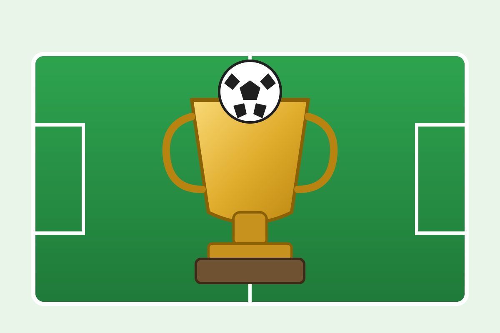
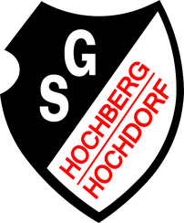

# Tournament-Information-Page

Statische, mobilefreundliche Website für Spieltags- und Turnierinformationen (GitHub Pages kompatibel).

## IST-Stand

Die Website besteht aus einer Startseite und separaten Unterseiten:

- `index.html` – Startseite mit Kurzinformationen, Countdown bis zum ersten Anpfiff und Navigation
- `verpflegung.html` – Verpflegungsinformationen
- `anfahrt.html` – Anfahrt, Parken, ÖPNV
- `spielfeldlayout.html` – Layout und Gruppen je Spielfeld
- `spielplan.html` – kompakter Spielplan mit Filterung, Dropdowns und Autocomplete

Auf der Startseite werden zusätzlich angezeigt:

- Countdown bis zum ersten Spiel (berechnet aus `event.date` + `event.startTime`)
- Trainerbesprechung (Uhrzeit und Ort)
- Siegerehrung (geplant: ja/nein, optional mit Zeit und Ort)
- Begrüßung des ausrichtenden Vereins SG Hochberg/Hochdorf

## Navigation und Darstellung

- Einheitliche Top-Leiste auf allen Seiten
- Aktive Seite in der Top-Leiste hervorgehoben
- Mobile-first Layout mit kompakter, sticky Kopfzeile
- Im Spielplan wird während des Turniers automatisch zum aktuell laufenden Spiel gescrollt

## Projektstruktur

- `styles.css` – responsives Layout inkl. kompakter Sticky-Kopfzeile
- `script.js` – Laden, Rendern, Countdown, Filterung, Autocomplete, Auto-Scroll
- `Host_Logo.png` – Gastgeberlogo für die Seitenköpfe
- `logo.svg` – Website-Logo
- `favicon.svg` – Favicon
- `data/*.json` – fachliche Datenquellen (Event, Verpflegung, Anfahrt, Spielfeldlayout, Spielplan)

## Logos und Favicon

- Website nutzt das Gastgeberlogo `Host_Logo.png` im Kopfbereich jeder Seite.
- Website-Logo `logo.svg` und Favicon `favicon.svg` sind als zentrale Assets im Repository enthalten.

## Lokal testen

```bash
python3 -m http.server 8000
./scripts/pages-preflight.sh
```

Danach öffnen: <http://localhost:8000>

## Vorschau Assets






